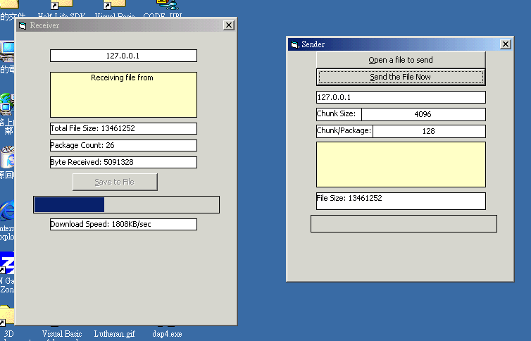



## A sample to transfer binary through winsock at very very high speed \(Meet industrial standard\)

### Description

Have you ever used <b>Flashget</b>, <b>NetAnt</b>, or <b>Download Accelerator</b>?

They can download very very fast because they <b>SPLIT up files into many

parts</b> to download together.

This program demonstrate how to use this technique to send all binary

files(exe, jpg, zip....) through winsock without corruption.

 
### More Info
 

             |
---                |---
**Submitted On**   |2002-06-25 23:46:06
**By**             |[Kenny Lai, Lai Ho Wa](https://github.com/Planet-Source-Code/PSCIndex/blob/master/ByAuthor/kenny-lai-lai-ho-wa.md)
**Level**          |Advanced
**User Rating**    |4.6 (158 globes from 34 users)
**Compatibility**  |VB 6\.0
**Category**       |[Internet/ HTML](https://github.com/Planet-Source-Code/PSCIndex/blob/master/ByCategory/internet-html__1-34.md)
**World**          |[Visual Basic](https://github.com/Planet-Source-Code/PSCIndex/blob/master/ByWorld/visual-basic.md)
**Archive File**   |[A\_sample\_t987616252002\.zip](https://github.com/Planet-Source-Code/kenny-lai-lai-ho-wa-a-sample-to-transfer-binary-through-winsock-at-very-very-high-speed-me__1-36240/archive/master.zip)

### Source Code

Have you ever used <b>Flashget</b>, <b>NetAnt</b>, or <b>Download Accelerator</b>?

They can download very very fast because they <b>SPLIT up files into many
parts</b> to download together.

This program demonstrate how to use this technique to send all binary
files(exe, jpg, zip....) through winsock without corruption.

As you know, the Microsoft Winsock Control only allow two type of data to be
transfer: One is string and one is<b> Byte Array</b>. In this tutorial, I will
use byte array to send file via winsock of course, as byte array is the only
data type that can store a huge binary file correctly without corruption.

The traditional method to sent binary files is just use the senddata method
to send the whole byte array of a huge file. You can imagine a 2MB file is
stored in a single byte array of count of 2000000!!!!!!! It is so large that if
you sent it directly through one line, your machine will go down deadly. Also,
the speed is extremely low, about 60-90 KBps. (All the speed here is measured
Local-to-Local only, which is the maximum speed that can reach.)

<b>In this program, I will send files through chunks</b>, of course. A chunk
is a group of defined number of bytes, my default is 4096 bytes per chunk(I have
done many experiments to find out the optimum size of each chunk). This means
one winsock will send the byte array for many times, each time with one chunk.
This can balance the use of CPU and memory with a great increase of performance,
about 400-600KBps.

But it still doesn't perform well. In my test, if I send a 12MB VB5CCE Zip
file, the speed decrease to 63KBps shortly.

<b>IS IT ENOUGH FOR INDUSTRIAL STANDARD? OF COURSE NOT!</b> It just utilized
one winsock only. In my program, I will split up the binary file into many
chunks of each 4096bytes, AND I will group 128 chunks into <b>ONE PACKAGE</b>.

The most cool stuff is that I open ONE Winsock for ONE Package, and Each use
a separate port! In the screen shot you can see, I send a 13MB file, and there's
26 package. That means I use 26 Winsock to send the file together. The speed is
awsome, 1808KBps, that is 14.125Mbps!!!!!!!

The method to split file and rebuild file is well commented. Please see it if
you like and test it.

I worked for a long
time to work out the structure for
binary byte array and send through
winsock, but if I just send the entire
file through one command, it is too
slowly, unreasonable even in
Local-to-Local. In fact, my program is
not trying to fool the server, but it
uses the idea of multi-threading.
Later, I will develop a binary-transfer
OCX with multi-thread support, one
package one thread. The method of
spliting up file is to use multiple
port and winsock to send file(As you
may know, a winsock has is own speed
limit that is quite slow). Sending
through chunks and package can REDUCE
the memory usage and INCREASE CPU load,
i.e. to draw the CPU performance. 

IN GENERAL, THE PURPOSE OF THIS PROGRAM
is to increase the MAXIMUM capacity of
transfer irrespective of the
bandwidth(the bottle-neck of internet
transfer). But technology with advance,
and the bandwidth will rise(How can you
imagine if both machines have T3
connections but the server only
transfer the file at a 40KBps limits?
That what I want to say and my purpose
of this program.

<b>PLEASE VOTE AND GIVE COMMENTS!</b>

